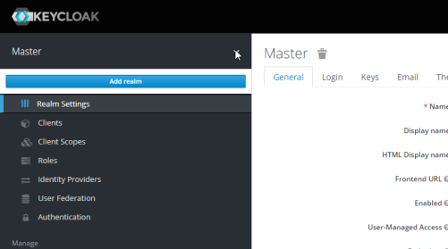
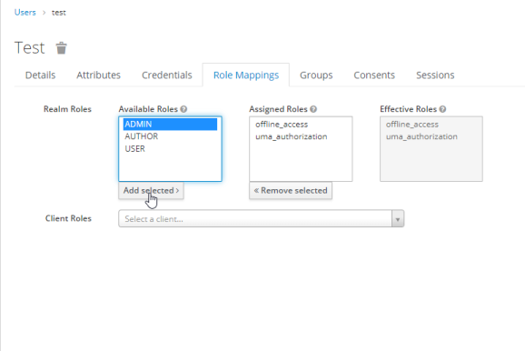
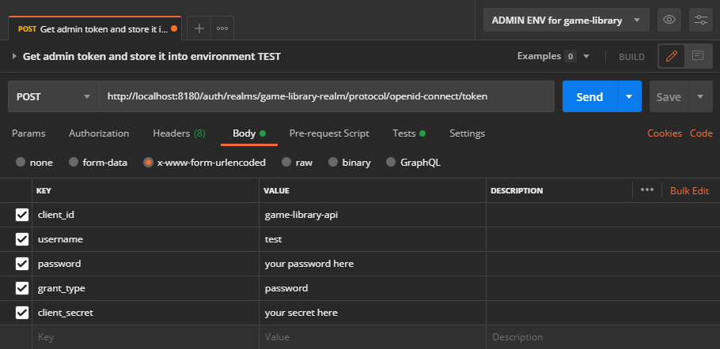

# Deploy and configure Keycloak
A guide to set up your keycloak service for this project.

##### 1 - Install the server
[Here](https://www.keycloak.org/downloads) download the server you need. Extract the archive.

##### 2 - Run it on port 8180
In bin folder, use the command `standalone.bat -Djboss.socket.binding.port-offset=100`.  
They in your browser, navigate to localhost:8180.

##### 4 - Configure the realm
To access the administration console, first create an initial admin. Then log in.
Then add a new realm   
  
 

Import the file `realm-settings.json` and create the realm.

##### 5 - Create an Admin
*This admin differs from the initial admin you set up, it will have rights only on the Game Library application, 
not onto the console*  
Go to **Manage > User > Add user**. Create your admin profile. Make sure that `Email verified` is ON.  
Then go to **Credentials** and set a password (not a temporary one).  
Finally, go to **Role Mapping** and assigne him roles ADMIN & USER.  
  

##### 6 - Generate secret
**Configure > Clients > game-library-api > Credentials > Regenerate secret**  
*You'll have to set this secret into the `application.properties` file later.*  
*it's done for keycloak, you can return to the [Game Library deploy guide](./README.md#3---create-the-database)*

##### 7 - OPTIONAL - Request for a bearer token via postman
Your request should look like this, at the end Keycloak should return a bearer token. This bearer token can then be
passed on each request on secured API endpoints.  
  

